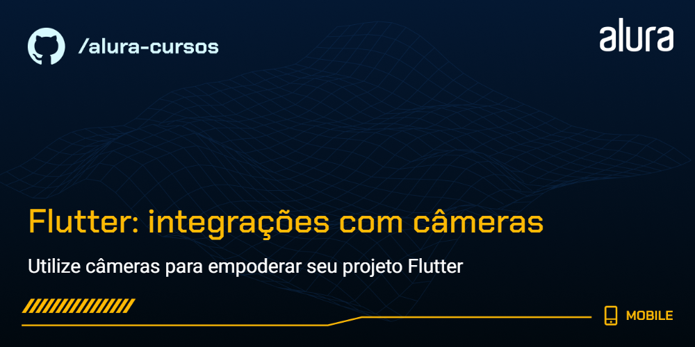

# Flutter: integrações com câmera

Projeto **Banco d'Ouro** para o curso de Flutter: integrações com câmera, focado em apresentar soluções de identificação, configuração e uso de câmeras para diversas situações usando Flutter.

### Tópicos abordados no curso:

- Aprender a detectar e obter informações sobre as câmeras disponíveis;
- Descobrir como lidar com permissões nos dispositivos nativos;
- Conhecer como inicializar uma câmera com configurações pré-definidas;
- Entender como visualizar a câmera em tempo real e como resolver os problemas relacionados;
- Conhecer atributos de câmera que podem ser controlados em tempo real;
- Aprender a apresentar elementos gráficos acima da câmera;
- Entender como capturar uma imagem da câmera;

Este curso é indicado para pessoas que já tem conhecimento intermediário e querem aprofundar seu conhecimento em Flutter, seguindo boas práticas e também entendendo como funciona internacionalização dentro dos padrões mobile.

## 📑 Requisitos

- Conhecimentos intermediários de Flutter e Dart;
- Android Studio ou VS Code (com plugins do Flutter e Dart instalados);
- É importante ter o Flutter na versão 3.24.5.

## ✨ Funcionalidades do projeto

- Configuração do plugin `camera`;
- Uso da função `availableCamera` para listar câmeras disponíveis;
- Declaração e inicialização do `CameraController` para controlar a câmera;
- Integração do `CameraPreview` para visualização em tempo real;
- Configurações de orientação usando o `CameraController`;
- Captura de foto usando `takePicture()`;
- Transmissão da foto capturada em forma de bytes;

## 🛠️ Abrir e rodar o projeto

Aqui vem um passo a passo para abrir e rodar o projeto.

- **Open an Existing Project** (ou alguma opção similar)
- Procure o local onde o projeto está e o selecione (Caso o projeto seja baixado via zip, é necessário extraí-lo antes de procurá-lo)
- Por fim clique em OK
- Depois basta rodar o comando `flutter run` na pasta do projeto
- Para esse projeto, recomendamos a conexão com um dispositivo físico, e não um emulador!